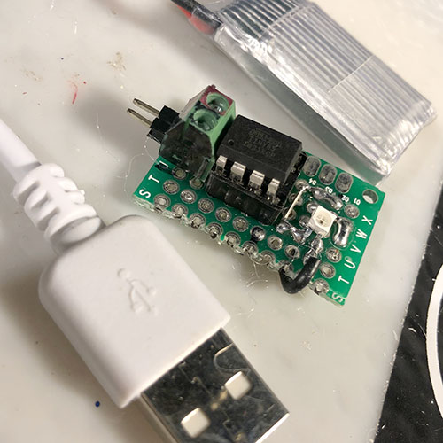
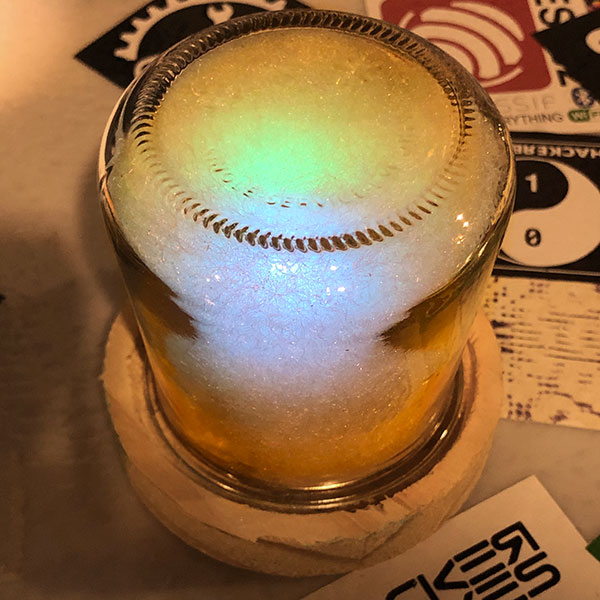

# ATTINY85 RGB Firefly
 Firefly in a jar art project using an ATTINY85 and WS2182b LEDs.

The whole structure is placed inside of an old yogurt glass and surrounded by 'pillow fluff'. I've started working on a wooden base as well.
 
 
 
 
